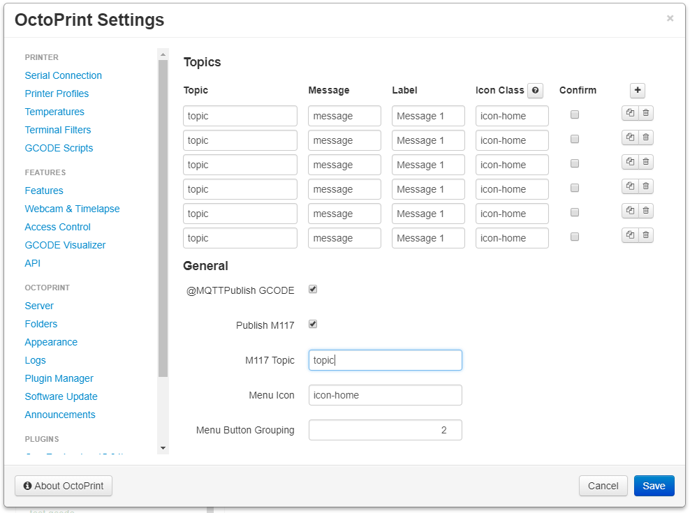

# OctoPrint-MQTTPublish

This plugin adds a menu to the navbar of OctoPrint to send configured MQTT messages to the MQTT server configured in the [MQTT Plugin](https://plugins.octoprint.org/plugins/mqtt/).

## Prerequisites

Install the [MQTT](https://github.com/OctoPrint/OctoPrint-MQTT) plugin via the Plugin Manager or manually using this url:

	https://github.com/OctoPrint/OctoPrint-MQTT/archive/master.zip

## Setup

Install via the Plugin Manager or manually using this URL:

    https://github.com/jneilliii/OctoPrint-MQTTPublish/archive/master.zip

## Configuration

Once the MQTT plugin and this plugin are installed, configure the MQTT plugin for connecting to your MQTT server.  Then in this plugin's settings configure the topics/commands you want to publish to that server.

## Settings


- Topics
  - Topic: topic to publish message to.
  - Message: message to send to topic.
  - Label: label to display on menu.
  - Icon: icon class name from [fontawesome](https://fontawesome.com/v4.7.0/icons/) to show on button.
  - Confirm: show a confirmation prompt on sending message.
- General
  - @MQTTPublish GCODE: If enabled sending **@MQTTPublish topic message** GCODE command will publish the given message to given topic.
  - Publish M117: If enabled will send any M117 messages to configured M117 Topic field.
  - Menu Icon: icon class name from [fontawesome](https://fontawesome.com/v4.7.0/icons/) to show in navbar.
  - Menu Button Grouping: Group buttons by this many and then start a new row in dropdown menu.


## Action Commands

Plugin supports a custom action command `MQTTPublish`. Configure your printer to use the command **//action:MQTTPublish topic message** in order for the plugin to publish the given message to given topic. For example, in Marlin's Configuration_adv.h uncomment the option `CUSTOM_USER_MENUS` and add a custom menu item for your controller like below.  When clicked the plugin receives the action command and will publish the message `turnoff` to the topic `octo`.

```
#define CUSTOM_USER_MENUS
#if ENABLED(CUSTOM_USER_MENUS)
  //#define USER_SCRIPT_DONE "M117 User Script Done"
  //#define USER_SCRIPT_AUDIBLE_FEEDBACK
  //#define USER_SCRIPT_RETURN  // Return to status screen after a script

  #define USER_DESC_1 "MQTTPublish"
  #define USER_GCODE_1 "M118 //action:MQTTPublish octo turnoff"

  //#define USER_DESC_2 "Preheat for PLA"
  //#define USER_GCODE_2 "M140 S" STRINGIFY(PREHEAT_1_TEMP_BED) "\nM104 S" STRINGIFY(PREHEAT_1_TEMP_HOTEND)

  //#define USER_DESC_3 "Preheat for ABS"
  //#define USER_GCODE_3 "M140 S" STRINGIFY(PREHEAT_2_TEMP_BED) "\nM104 S" STRINGIFY(PREHEAT_2_TEMP_HOTEND)

  //#define USER_DESC_4 "Heat Bed/Home/Level"
  //#define USER_GCODE_4 "M140 S" STRINGIFY(PREHEAT_2_TEMP_BED) "\nG28\nG29"

  //#define USER_DESC_5 "Home & Info"
  //#define USER_GCODE_5 "G28\nM503"
#endif
```

**NOTE:** Marlin versions 2.0.8 and above changed `#define CUSTOM_USER_MENUS` to `#define CUSTOM_MENU_MAIN`

## Get Help

If you experience issues with this plugin or need assistance please use the issue tracker by clicking issues above.

### Additional Plugins

Check out my other plugins [here](https://plugins.octoprint.org/by_author/#jneilliii)

### Sponsors
- Andreas Lindermayr
- [@Mearman](https://github.com/Mearman)
- [@TheTuxKeeper](https://github.com/thetuxkeeper)
- [@tideline3d](https://github.com/tideline3d/)
- [OctoFarm](https://octofarm.net/)
- [SimplyPrint](https://simplyprint.dk/)
- [Andrew Beeman](https://github.com/Kiendeleo)
- [Calanish](https://github.com/calanish)
- [Lachlan Bell](https://lachy.io/)
- [Johnny Bergdal](https://github.com/bergdahl)
- [Leigh Johnson](https://github.com/leigh-johnson)
- [Stephen Berry](https://github.com/berrystephenw)
- [Guyot François](https://github.com/iFrostizz)
- [Steve Dougherty](https://github.com/Thynix)
## Support My Efforts
I, jneilliii, programmed this plugin for fun and do my best effort to support those that have issues with it, please return the favor and leave me a tip or become a Patron if you find this plugin helpful and want me to continue future development.

[](https://www.patreon.com/jneilliii) [](https://paypal.me/jneilliii)

<small>No paypal.me? Send funds via PayPal to jneilliii&#64;gmail&#46;com</small>
